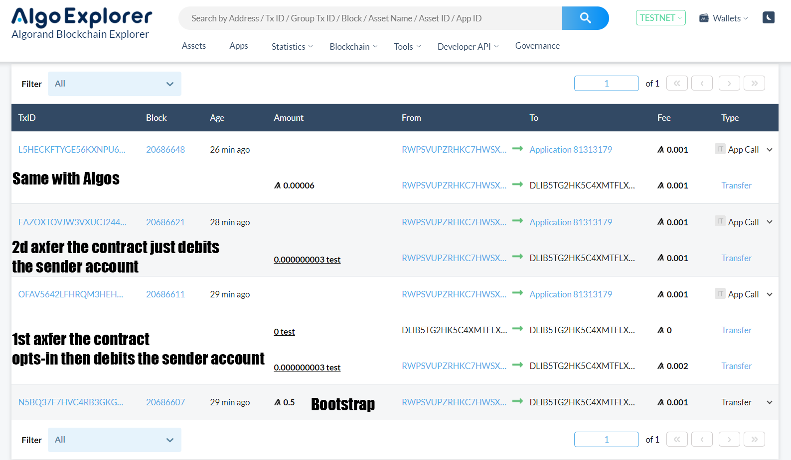

## Single Transaction Deposit

This smart contract lets an app-call rekeyed to the app withdraw assets from the sender account and rekey the sender account back to it once it's done.

I have commented every part of the TEAL to explain the contract in detail.

### High-level explanation

The contract is able to withdraw Algos or ASA from the sender account as well as opt-in those ASA if it needs to.

The structure of the app call is as follows:  
appArgs = [ amount ]  
foreignAssets = undefined || [ assetID ]

The contract assumes that an empty foreignAssets array means an Algo deposit.  
On the other hand if a foreignAsset is present in the array the contract will treat this as an asset deposit.

When deploying the contract I am bootstrapping its account with 0.5 Algo, meaning it can opt-in 4 assets before falling under the min_balance requirement.  
Depending on your needs the 0.1 Algo needed to opt-in a new asset could be added to the opt-in logic to be paid by the end-user.

### Make it work in your repo

After you clone this repo, create an .env file in your repo's root folder with `Mnemo="your 25 words"`  
`nmp install` will install the dependencies in your folder.  
`npm run start` will run index.js. Just comment / uncomment the functions you want to run.

If you want to deploy your own app just run `npm run create-app` then copy the appID that will show in the console in ./constants/appIndex

### Screenshot example

